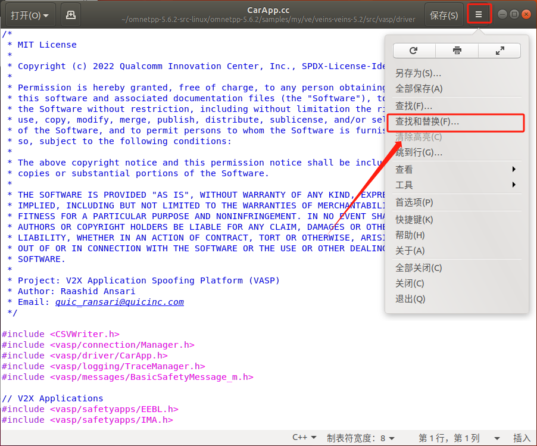

# VASP
## 1. VASP install
需在虚拟机中安装相应的Veins、SUMO与OMNet++，安装教程可参考[[link]](https://github.com/Yrongovo/Veins5.2-Ubuntu18.04-Installation-Guide)
- 将两个文件包复制到虚拟机桌面

  [CSVWriter.h](./CSVWriter.h)

  [json.h](./json.h)
- 将桌面的两个文件复制到虚拟机中的`/usr/include`中

- 打开`OMNeT++`中的`configure.user`文件，取消注释`CXXFLAGS=-std=c++11`

- 将`vasp`复制到虚拟机`<veins>/src`中 (`<veins>`以自己具体路径为准)

    [vasp](./vasp/)

- 进入`<veins>/src/vasp/driver`中键入
    ```
    sudo gedit CarApp.cc
    ```
    
    
- 全部替换 

    
- 修改`json.h`权限，在`/usr/include`中键入
    ```
    sudo chmod 777 json.h
    ```
    
- 进入`<veins>`键入
    ```
    ./configure && make -j6
    ```
    
- 启动服务器，`<veins>`中键入
    ```
    bin/veins_launchd -vv
    ```
    
- 运行模拟，进入`<veins>/src/vasp/scenario/`,键入
    ```
    ./run -u Cmdenv
    ```
    
    